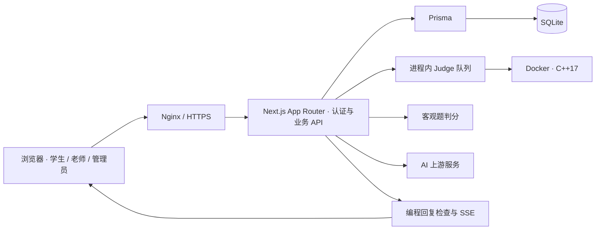

# C++ 在线 OJ 教学平台

[](https://nextjs.org/)
[](https://react.dev/)
[](https://www.typescriptlang.org/)
[](LICENSE)

**把做题、考试、AI 辅导和课后专项练习放进同一个教学流程。**

面向 C++ 入门教学、课后练习和固定小班考试的在线评测平台。学生可以编写 C++17 代码、完成选择判断题、查看反馈；老师可以组卷、跟进学情并下发个性化练习；管理员负责题库、账号和教学策略。

[访问平台](https://botcode.work) · [快速开始](#快速开始) · [功能与角色](#功能与角色) · [AI 辅导](#ai-辅导) · [开发者导航](#开发者导航) · [部署与限制](#部署与限制)

同步仓库：[wenbob/OJ](https://github.com/wenbob/OJ) · [wenbob/2026-OJC](https://github.com/wenbob/2026-OJC)。两者维护同一套项目，任选一个克隆即可。

> [!IMPORTANT]
> 当前架构面向低并发、单实例教学，不提供高并发竞赛容量承诺。正式使用必须启用 Docker Judge、HTTPS、强随机会话密钥和数据库备份。本文中的演示账号仅由本地初始化创建，不是线上体验账号。

## 功能与角色

| 场景 | 已实现的能力 |
| --- | --- |
| 日常做题 | 编程题与选择判断题、Monaco 编辑器、本地草稿、题面公式与表格、提交记录、错题本和天梯 |
| 编程评测 | C++17、公开样例与自定义输入试运行、正式提交、Docker 资源隔离、按账号公平调度 |
| 正式考试 | 同题型组卷、发布快照、倒计时、交卷与计分、防误后退、有审计的误交卷恢复 |
| AI 辅导 | 理解题目、下一步提示、代码检查、自由追问，以及独立授权的选择判断解析 |
| 教师跟进 | 编程学情、持续卡题与最近失败、推荐练习、批量作业、每名学生的个性化题单 |
| 后台管理 | Markdown 导入、题目分类与排序、软下架、用户权限、AI 配置、站点标题图标和备案页脚 |

| 角色 | 可以做什么 | 主要边界 | 操作手册 |
| --- | --- | --- | --- |
| 学生 | 做题、参加考试、完成专项练习、使用已授权 AI | 只读自己的提交；正式评测隐藏测试数据；客观题 AI 须单独解锁 | [学生使用说明](docs/student-guide.md) |
| 老师 | 校题、创建学生、组卷、下发作业、查看全体学生学情和 AI 使用 | 只管理自己的考试和作业；不能维护全局题库、系统设置或后台账号 | [老师端使用说明](docs/teacher-guide.md) |
| 管理员 | 管理题库、用户、全部考试与作业、AI 策略和站点设置 | 关键操作受角色鉴权、事务、版本校验或审计约束 | [管理员使用说明](docs/admin-guide.md) |

几个容易混淆的规则：

- **试运行不等于提交**：只检查公开样例或自定义输入，不写入 `Submission`，不影响考试成绩、积分和作业进度。自定义输入只展示运行结果，不判断答案正确与否。
- **做过不等于完成作业**：专项练习须从任务入口重新提交 Accepted；普通练习、考试和历史 AC 不抵扣。
- **后退不等于交卷**：浏览器后退会被拦截；刷新、关闭或离开考试会触发交卷处理。同场切题、切换浏览器标签不交卷，服务端另行校验截止时间。
- **恢复不等于重新计时**：仅管理员或考试所属老师可恢复符合条件的误交卷记录，保留原截止时间与历史作答。
- **客观题反馈不等于 AI 解析**：普通提交和考试结果不展示标准答案；授权后的日常客观题 AI 解析可展示当前小题的正确答案与讲解，正式考试不开放该入口。

## 快速开始

以下步骤只用于新建的本地开发数据库。运行基础做题与考试功能不需要配置 AI 密钥。

### 1. 准备环境

| 组件 | 要求 |
| --- | --- |
| Node.js 与 npm | 64 位开发环境使用 Node.js 22（`>=22.13.0`）或 24；版本要求同时考虑锁文件中的应用、测试与 Lint 工具 |
| Git | 克隆仓库 |
| 评测环境，二选一 | 本地 `g++`（支持 C++17 并加入 PATH），或 Docker Engine / Docker Desktop 的 Linux 容器 |
| 浏览器 | 用于访问本地平台；Windows 的 E2E 配置另要求已安装 Google Chrome |

> 本地 `local` Judge 会直接执行代码，只用于可信代码调试。处理学生或其他不受信任来源的代码时，请使用 Docker Judge。

### 2. 获取项目并安装依赖

使用统一目录名，两个仓库的后续步骤完全相同：

```bash
git clone https://github.com/wenbob/OJ.git cpp-oj
cd cpp-oj
npm ci
```

若选择另一个仓库，仅将克隆地址替换为 `https://github.com/wenbob/2026-OJC.git`，目标目录仍为 `cpp-oj`。

### 3. 配置本地环境

Windows PowerShell：

```powershell
Copy-Item .env.example .env
```

macOS / Linux：

```bash
cp .env.example .env
```

打开 `.env`，保留以下本地配置，并把 `SESSION_SECRET` 替换为至少 32 位的随机字符串：

```env
DATABASE_URL="file:./dev.db"
SESSION_SECRET="replace-this-with-a-long-random-string"
APP_ORIGIN=http://127.0.0.1:3000
SESSION_COOKIE_SECURE=false
OJ_LISTEN_HOST=127.0.0.1
JUDGE_MODE=local
```

完整配置项及 Judge 默认限制见 [`.env.example`](.env.example)。没有 `g++` 或准备使用 Docker 时，先构建镜像：

```bash
docker build -t oj-cpp-judge ./docker/judge-cpp
```

再将 `.env` 中的 Judge 配置改为：

```env
JUDGE_MODE=docker
JUDGE_DOCKER_IMAGE=oj-cpp-judge
```

### 4. 初始化本地数据并启动

> [!WARNING]
> `db:init` 和 `seed` 都包含破坏式写入，只能对允许重建的本地数据库执行。不要在已有教学数据或生产数据库上运行，也不要把它们当成日常启动步骤。

```bash
npm run db:init
npm run seed
npm run dev -- --hostname 127.0.0.1
```

访问 [本地登录页](http://127.0.0.1:3000/login)。后续开发只需运行最后一条启动命令；保持浏览器访问地址与 `APP_ORIGIN` 一致。

仅执行上述本地 seed 后，才会创建以下账号：

| 角色 | 用户名 | 本地演示密码 |
| --- | --- | --- |
| 管理员 | `admin` | `admin123` |
| 学生 | `student1`、`student2` | `123456` |

这些密码来自 [`prisma/seed.ts`](prisma/seed.ts)，不要用于外部可访问环境。老师账号需由管理员创建；老师新建或重置学生时使用的固定初始密码是 `12345678`，与 seed 演示密码不同。

### 5. 跑通第一条教学流程

1. 以管理员登录，查看“题目管理”中的演示题，并按需创建老师和学生账号。
2. 退出后以 `student1` 登录，在“日常刷题”打开“A+B 问题”，编写代码，先运行样例再正式提交。
3. 看到 Accepted 后，查看提交详情与天梯，确认做题、评测、记录和计分相互贯通。
4. 以管理员或老师创建并发布一场考试，再以学生身份开始、提交、交卷并查看结果。
5. 在学情页面查看编程提交，给学生下发专项练习，再从学生的专项入口完成它。

[健康接口](http://127.0.0.1:3000/api/health) 返回 `ok: true`、`database: "ok"` 表示应用和数据库查询正常；它不能代替一次实际 Judge 验证。

## AI 辅导

AI 是可选能力。服务端支持 DeepSeek、豆包和自定义 OpenAI-compatible 服务；管理员分别配置“编程题 AI”与“选择判断 AI”，密钥只从运行应用的 `.env` 读取：

```env
DEEPSEEK_API_KEY=
ARK_API_KEY=
AI_CUSTOM_API_KEY=
```

只填写实际使用的服务商密钥。管理员在“系统设置”选择服务商、模型、思考模式、教学提示词和触发间隔；学生个人权限在用户管理中开通。修改环境变量后重启应用；数据库中的非敏感 AI 配置保存后生效。

| 入口 | 开放条件与输出 |
| --- | --- |
| 学生编程助手 | 个人权限与日常/本场考试开关共同控制；只提供题意、提示和问题位置，服务端拦截代码片段及直接答案 |
| 学生选择判断解析 | 主开关、学生总开关、个人权限均开启，且当前大题已有一次日常提交；可按小题查看数据库标准答案和解析 |
| 正式考试中的客观题 AI | 不开放；账号有有效进行中正式考试时，在其他页面也不能绕过限制 |
| 老师与管理员后台 AI | 编程助手使用后台开关，客观题解析遵守客观题主开关，并校验资源权限；后台调用不混入学生 AI 使用统计 |

### 流式响应是怎样实现的

编程助手采用 `fetch POST + SSE`。等待期间每 2 秒发送状态心跳；上游返回完整回复并通过安全清洗、保存审计后，再分片发送给浏览器。当前没有把模型原始 Token 直接透传给学生。

```text
浏览器发起 POST
  → 服务端校验权限，建立 SSE 响应并发送等待状态
  → 获取上游完整回复，检查与清洗，保存审计
  → 发送安全文本 chunk
  → 浏览器逐段追加文字，收到 done 或 error 后结束
```

这保留了“检查通过后才向学生展示正文”的边界；SSE 提供等待反馈，但不会缩短上游生成完整回答所需的时间。

想学习实现，可按顺序阅读：[前端请求与显示](src/components/ProblemAiAssist.tsx) → [路由与流式响应](src/lib/problemAiAssistRoute.ts) → [内容检查](src/lib/aiAssist.ts) → [SSE 编码与解析](src/lib/aiAssistStream.ts)。

审计保存学生可见问答与用量统计，不保存代码快照、完整 Prompt、内部推理、密钥或请求头。详细配置见 [管理员手册](docs/admin-guide.md)。

## 开发者导航

### 系统架构



编程题经队列与 Docker 评测；客观题直接在服务端判分。两类结果写入提交记录，再按角色返回可见信息。正式考试发布时固定题目与分值快照，后续题库编辑不改写历史计分依据。

技术栈：Next.js 16、React 19、TypeScript 6、Tailwind CSS、Prisma 6、SQLite、Monaco、KaTeX、Vitest、Playwright。具体依赖以 [`package.json`](package.json) 和 [锁文件](package-lock.json) 为准。

### 从哪里开始读代码

| 关注点 | 入口 |
| --- | --- |
| 页面、布局、API | [`src/app/`](src/app/) |
| Monaco 编辑器 | [`CodeEditor.tsx`](src/components/CodeEditor.tsx) |
| 题面渲染与导入 | [`ProblemRichText.tsx`](src/components/ProblemRichText.tsx)、[`markdownParser.ts`](src/lib/markdownParser.ts) |
| 登录与权限 | [`auth.ts`](src/lib/auth.ts)、[`src/app/api/auth/`](src/app/api/auth/) |
| 评测与队列 | [`judge.ts`](src/lib/judge.ts)、[`judgeQueue.ts`](src/lib/judgeQueue.ts)、[Judge 镜像](docker/judge-cpp/) |
| 学生提交脱敏 | [`submissionVisibility.ts`](src/lib/submissionVisibility.ts) |
| 考试计分与离开保护 | [`examScoring.ts`](src/lib/examScoring.ts)、[`ExamExitGuard.tsx`](src/components/ExamExitGuard.tsx) |
| 学情与专项练习 | [`learningAnalytics.ts`](src/lib/learningAnalytics.ts)、[`learningAssignments.ts`](src/lib/learningAssignments.ts) |
| 数据库与迁移 | [`schema.prisma`](prisma/schema.prisma)、[`migrations/`](prisma/migrations/)、[`init.sql`](prisma/init.sql) |
| 浏览器测试与运维 | [`e2e/`](e2e/)、[`scripts/`](scripts/)、[`deploy/`](deploy/) |

<details>
<summary>展开：核心数据模型</summary>

| 模型 | 职责 |
| --- | --- |
| `User` / `StudentProfile` | 账号、角色、会话版本、头衔和两项学生 AI 权限 |
| `Problem` / `TestCase` / `ProblemCategoryOrder` | 题型、题面、分类排序、客观题内容与测试点 |
| `Submission` / `SubmissionCaseResult` | 日常/考试提交及逐测试点或逐小题结果 |
| `Exam` / `ExamProblem` / `ExamRecord` | 考试归属、发布快照、作答、截止时间与成绩 |
| `ExamRecordResumeAudit` | 误交卷恢复的操作者、原因与时间 |
| `LearningAssignment` / `LearningAssignmentProblem` | 专项练习、题目快照与完成进度 |
| `LearningInsightSnapshot` | 按学生与周期缓存的学情摘要 |
| `AiConversation` / `AiConversationTurn` | 学生可见 AI 对话、幂等标识与调用统计 |
| `ObjectiveAiExplanation` | 跨角色共享的逐小题解析缓存 |
| `SystemSetting` | 站点、AI、Judge 默认值和备案配置 |

修改数据库结构时，须同步 Prisma schema、migration 与本地初始化 SQL。

</details>

<details>
<summary>展开：API 概览</summary>

| 范围 | 接口入口 |
| --- | --- |
| 认证 | `POST /api/auth/login`、`POST /api/auth/logout`、`GET /api/auth/me` |
| 健康与公共配置 | `GET /api/health`、`GET /api/settings/public` |
| 题库与提交 | `/api/problems/*`、`/api/submissions/*`、`/api/exam-submissions/*` |
| 编程试运行 | `POST /api/problems/[id]/run` |
| 学生 AI | `POST /api/ai/problem-assist`、`POST /api/problems/[id]/objective-explanation` |
| 学生考试 | `/api/exams/*`，包括开始、答题、交卷和超时结算 |
| 题目、用户与考试管理 | `/api/admin/problems/*`、`/api/admin/users/*`、`/api/admin/exams/*` |
| 学情与专项练习 | `/api/admin/learning/*` |
| 提交与 AI 审阅 | `/api/admin/submissions/*`、`/api/admin/exam-submissions/*`、`/api/admin/ai-usage/*` |
| 设置与模型发现 | `GET /api/admin/settings`、`PUT /api/admin/settings`、`POST /api/admin/ai-provider/models` |

管理 API 的 `/admin/` 路径不代表老师一律不可访问；服务端按具体操作校验角色与资源归属。普通学生题目/提交接口不返回客观题标准答案，授权的客观题 AI 解析使用单独入口。

</details>

### 常用命令与验证

| 命令 | 用途 |
| --- | --- |
| `npm run dev -- --hostname 127.0.0.1` | 启动本地开发服务 |
| `npm run test` | Vitest 单元与接口测试 |
| `npx tsc --noEmit` / `npm run lint` | 类型检查 / ESLint |
| `npm run test:e2e` | 使用隔离数据库和 3100 端口执行 Playwright |
| `npm run build` | 生成 Next.js standalone 构建 |
| `npm run start` | 检查环境、加载配置并启动已准备好的 standalone 服务 |
| `npm run check:env` | 校验生产环境要求，不是检查本地最小配置 |
| `npm run db:migrate` / `npm run db:deploy` | 开发时创建迁移 / 应用已有迁移 |
| `npm run db:status` | 查看迁移状态 |

E2E 的 Windows 配置使用已安装的 Google Chrome；macOS / Linux 首次运行可用 `npm run test:e2e:install` 安装 Chromium。具体配置见 [`playwright.config.ts`](playwright.config.ts)。这些浏览器测试覆盖关键业务边界，不能替代真实 Docker 评测和课堂并发验证。

修改业务代码时，按影响范围运行测试、类型检查、Lint 和构建；考试、权限、Judge 或 AI 改动还应验证相应关键流程。当前仓库未配置 GitHub Actions 自动执行这些检查。

## 部署与限制

现有站点入口为 [botcode.work](https://botcode.work)，生产目录约定为 `/www/oj`。发布、备份、回滚和证书操作以 [部署手册](docs/deploy.md) 与 [协作规则](AGENTS.md) 为准；已有站点更新请从部署手册的“11. 后续更新流程”开始阅读。

- **运行配置**：当前生产入口使用 `APP_ORIGIN=https://botcode.work`、`SESSION_COOKIE_SECURE=true`、`OJ_LISTEN_HOST=127.0.0.1`；数据库使用绝对路径 `file:/www/oj/prisma/prod.db`。自行部署时应一致配置自己的 HTTPS 域名、路径与反向代理。
- **构建与启动**：低内存生产机使用本地 Linux/Docker 构建的 Ubuntu standalone 包；不可上传 Windows 构建产物。补齐 `.next/static` 和 `public`，使用 OpenSSL 3 对应的 Prisma 引擎，并通过 `npm run start` 启动。
- **数据与发布包**：发布前确认无有效进行中考试并验证备份非空；生产禁止 `seed` 和 `db:init`。归档排除所有层级的环境文件、数据库、备份、缓存、Windows 依赖和嵌套压缩包；依赖更新按部署手册准备 Linux 依赖。
- **访问与权限**：Nginx 承接公网 HTTPS，应用只监听本机。应用目录保持 `0755`，生产 `.env` 保持 `0600`；按手册完成迁移、重启和健康/静态资源/登录/Judge 验证。

<details>
<summary>展开：Judge 默认队列与资源边界</summary>

- 默认同时评测 1 个任务，最多等待 50 个，排队超时 60 秒；每账号最多运行 1 个、等待 2 个任务。
- 正式提交优先于未开始的试运行，同优先级按账号轮转，不中断已运行任务。
- 单题最多 100 个测试点；单点输入输出合计 256KB，整题 2MB；默认整任务预算 60 秒。
- 首个超时或运行异常停止后续测试；队列满、排队超时、Docker/编译器基础设施故障返回可重试 `503`。
- Docker 禁网、只读根文件系统、移除 capabilities、禁止提权，并限制 CPU、内存、PID、编译产物和输出。
- 学生正式评测结果不包含测试输入、期望输出、程序输出或内部运行错误；编译错误可保留用于排查语法问题。

队列参数见 [`.env.example`](.env.example)，完整边界见 [`AGENTS.md`](AGENTS.md)。

</details>

已知限制与后续方向：

| 当前状态 | 后续可考虑的工作，尚非已实现能力 |
| --- | --- |
| SQLite + 进程内队列，等待任务不持久化 | 先测清课堂容量；多实例部署前处理队列、限流和数据并发 |
| 健康接口只检查应用配置与数据库查询 | 接入队列指标、评测耗时、错误率与告警 |
| 已有测试脚本，未接入仓库 CI | 自动运行质量检查，并验证迁移与初始化 SQL 一致性 |
| 已有备份脚本与恢复手册 | 一致性备份、异地副本与隔离恢复演练 |
| 已有个人学情与作业，尚无独立班级模型 | 按教学需求增加班级管理、成绩导出与题目标签 |
| Docker 提供基础隔离，未验证高风险公网竞赛场景 | 独立评测 Worker 与进一步沙箱隔离 |

## 文档与参与

| 想了解什么 | 阅读入口 |
| --- | --- |
| 学生如何做题、考试和使用 AI | [学生使用说明](docs/student-guide.md) |
| 老师如何校题、组卷、管理学生和作业 | [老师端使用说明](docs/teacher-guide.md) |
| 管理员如何导入题目、配置权限和 AI | [管理员使用说明](docs/admin-guide.md) |
| 如何部署、备份、回滚和排查异常 | [线上部署与维护手册](docs/deploy.md) |
| 修改代码必须遵守哪些边界 | [`AGENTS.md`](AGENTS.md) |
| 历史变更有哪些验收证据 | [`docs/`](docs/) 中的 `ops-review-*.md`；仅作历史记录，不替代当前操作手册 |

欢迎通过所用仓库的 Issues 反馈问题或提交 Pull Request。问题报告请说明角色、页面、复现步骤、预期与实际结果；涉及学生信息时先脱敏，不要上传真实代码、账号数据、隐藏测试、数据库、`.env` 或密钥。修改前阅读协作规则，保持两个仓库的代码与文档同步。

本项目采用 [Apache License 2.0](LICENSE)。
