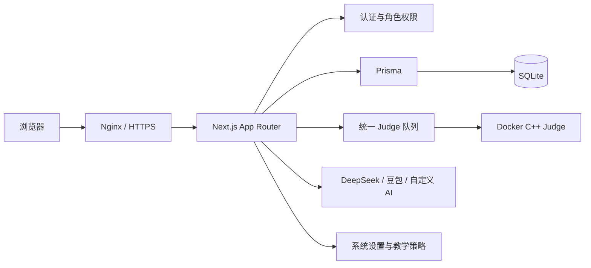

# C++ 在线 OJ 教学平台

[](https://nextjs.org/)
[](https://react.dev/)
[](https://www.typescriptlang.org/)
[](https://www.prisma.io/)
[](LICENSE)
[](https://botcode.work)

面向课堂教学、课后练习和固定小班考试的 C++ 在线评测平台。项目覆盖编程题与选择判断题、Docker Judge、正式考试、分层 AI 辅导、教师学情、专项作业、题库管理和分级权限，是一套可以本地运行、也可以小规模正式部署的完整教学系统。

> [!IMPORTANT]
> 当前架构适合本地演示、内部验证和固定小班低并发教学，不建议直接作为大规模公网 OJ 或高并发竞赛平台。生产环境必须使用 Docker Judge、强随机会话密钥、HTTPS 和定期数据库备份。

**在线入口：** [https://botcode.work](https://botcode.work)

**同步仓库：** [wenbob/OJ](https://github.com/wenbob/OJ) · [wenbob/2026-OJC](https://github.com/wenbob/2026-OJC)

## 项目亮点

| 能力 | 说明 |
| --- | --- |
| 双题型评测 | 编程题使用 C++17 Judge；选择判断题由服务端逐题判分，同一场考试不混合题型 |
| 教学型考试 | 支持发布快照、倒计时、自动交卷、防误后退、成绩计算和有审计的误交卷恢复 |
| 安全评测 | 生产环境使用无网络、只读根文件系统、受限 CPU/内存/PID/capability 的 Docker Judge |
| 分层 AI 辅导 | 提供理解题目、下一步提示、代码检查和客观题解析；不返回完整代码、最终答案或隐藏测试 |
| 教师闭环 | 学情诊断、错题分析、推荐练习、批量作业、个性化题单和学生 AI 权限管理 |
| 权限与数据保护 | 学生、老师、管理员三级角色；隐藏测试服务端脱敏；学生单设备登录；关键考试操作使用事务保护 |
| 题库运营 | Markdown 批量导入、题型/分类/难度管理、自定义排序、软下架和历史 AC 保留 |
| 运维基线 | Linux standalone、PM2、Nginx、HTTPS、SQLite 备份、健康检查和完整发布/回滚手册 |

## 角色与边界

| 角色 | 主要能力 | 明确限制 |
| --- | --- | --- |
| 学生 | 日常刷题、专项练习、正式考试、提交记录、错题本、天梯和受控 AI 辅导 | 只能读取自己的提交；永远看不到隐藏测试和客观题标准答案 |
| 老师 | 校题、管理学生、创建自己的考试、发布自己的作业、查看学生学情与 AI 使用 | 不能维护全局题库、系统设置、AI 模型、老师或管理员账号 |
| 管理员 | 题库、用户、考试、作业、提交、AI 配置、系统设置和全局运营 | 关键写操作按场景受到事务、版本号、最后管理员保护或专项审计约束 |

详细操作请直接阅读对应手册：

- [学生使用说明](docs/student-guide.md)
- [老师端使用说明](docs/teacher-guide.md)
- [管理员使用说明](docs/admin-guide.md)
- [线上部署与维护手册](docs/deploy.md)

`docs/ops-review-*.md` 保存历史发布和事故证据，其中的旧命令可能已经失效；当前部署与回滚始终以 `docs/deploy.md` 和 `AGENTS.md` 为准。

## 系统架构



核心请求流程：

```text
学生读取题目
  -> 编写 C++17 代码或逐行填写客观题答案
  -> 样例/自定义输入试运行（不写 Submission）
  -> 正式提交
  -> 服务端校验账号、题目、考试和作业上下文
  -> Judge 队列或客观题判分
  -> 保存 Submission 与逐测试点/逐小题结果
  -> 按角色返回脱敏后的结果
```

### 技术栈

- Next.js App Router、React、TypeScript、Tailwind CSS
- Prisma、SQLite、bcryptjs
- Monaco Editor、KaTeX、lucide-react
- Vitest、Playwright、ESLint
- C++17、Docker Judge
- Linux standalone、PM2、Nginx

## 快速开始

### 环境要求

- Node.js `>= 20.9.0`
- npm
- 本地 Judge：PATH 中可用的 `g++`
- Docker Judge：Docker Engine 和项目 Judge 镜像

### 1. 获取代码并安装依赖

```bash
git clone https://github.com/wenbob/OJ.git
cd OJ
npm ci
```

也可以从同步仓库 `https://github.com/wenbob/2026-OJC.git` 克隆。

### 2. 创建本地环境配置

macOS / Linux：

```bash
cp .env.example .env
```

Windows PowerShell：

```powershell
Copy-Item .env.example .env
```

本地最小配置已经写在 `.env.example`。至少应把 `SESSION_SECRET` 替换为自己的长随机字符串：

```env
DATABASE_URL="file:./dev.db"
SESSION_SECRET="replace-this-with-a-long-random-string"
APP_ORIGIN=http://127.0.0.1:3000
SESSION_COOKIE_SECURE=false
OJ_LISTEN_HOST=127.0.0.1
JUDGE_MODE=local
```

AI 能力是可选项。密钥只能保存在服务器 `.env`：

```env
DEEPSEEK_API_KEY=
ARK_API_KEY=
AI_CUSTOM_API_KEY=
```

不要把真实 `.env`、API Key、数据库或备份提交到 Git。

### 3. 初始化本地数据库

```bash
npm run db:init
npm run seed
```

> [!WARNING]
> `npm run db:init` 会执行破坏式初始化，只能用于明确允许重建的本地数据库。生产环境禁止执行 `db:init` 和 `seed`，只能使用 `npm run db:deploy` 应用迁移。

Seed 默认创建以下本地演示账号：

| 角色 | 用户名 | 密码 |
| --- | --- | --- |
| 管理员 | `admin` | `admin123` |
| 学生 | `student1` | `123456` |
| 学生 | `student2` | `123456` |

这些密码只用于本地演示；任何外部可访问环境都必须立即修改默认管理员密码。

### 4. 启动开发服务

```bash
npm run dev
```

访问 [http://127.0.0.1:3000/login](http://127.0.0.1:3000/login)。

如果要在本地使用 Docker Judge：

```bash
docker build -t oj-cpp-judge ./docker/judge-cpp
```

然后在 `.env` 中设置：

```env
JUDGE_MODE=docker
JUDGE_DOCKER_IMAGE=oj-cpp-judge
```

## 常用命令

| 命令 | 用途 |
| --- | --- |
| `npm run dev` | 启动本地开发服务器 |
| `npm run test` | 运行 Vitest 单元与接口测试 |
| `npm run test:e2e` | 使用隔离数据库和 3100 端口运行 Playwright 关键流程 |
| `npx tsc --noEmit` | TypeScript 类型检查 |
| `npm run lint` | ESLint 检查 |
| `npm run build` | 生成 Next.js 生产构建 |
| `npm run check:env` | 校验生产环境变量和危险配置 |
| `npm run db:init` | 破坏式初始化本地数据库 |
| `npm run db:migrate` | 创建本地 Prisma migration |
| `npm run db:deploy` | 应用已有 migration |
| `npm run db:status` | 查看 migration 状态 |
| `npm run backup:sqlite` | 在 Windows 备份 SQLite 数据库 |

首次运行 E2E 且本机缺少 Playwright Chrome 时：

```bash
npm run test:e2e:install
```

## 主要功能

### 做题与评测

- 编程题与选择判断题独立筛选、导入、组卷和考试。
- Monaco 提供语法高亮、行号、缩进、括号匹配、字号调节和本地草稿。
- 为减少课堂干扰，自动建议、单词建议、Tab 补全、参数提示和内联建议默认关闭。
- 编程题支持公开样例试运行和自定义输入；试运行不创建提交、不影响积分、考试成绩或作业进度。
- 正式提交支持 Accepted、Wrong Answer、Compile Error、Runtime Error 和 Time Limit Exceeded。
- 学生正式提交只返回状态和安全错误；隐藏输入、期望输出、程序输出及运行细节在服务端统一脱敏。

### 正式考试

- 草稿、已发布、已结束三种状态；只有草稿可修改题单和核心信息。
- 发布时固化题目标题、题型、客观题内容和分值，历史成绩不受题库后续修改影响。
- 支持倒计时、自动超时、幂等交卷、多题题签和按考试隔离的代码草稿。
- 浏览器后退、`Alt+Left` 和鼠标后退会留在当前题目；刷新、关闭、外部跳转和退出仍按规则交卷。
- 管理员或考试所属老师可以在原截止时间前恢复误交卷记录；原因和操作者写入审计，恢复不会延长时间。

### AI 教学能力

- 编程助手提供理解题目、下一步提示、检查代码和自由追问。
- 客观题解析按题目与小题共享，并以数据库答案为唯一权威。
- 学生 AI 同时受全局开关、个人权限、日常/考试范围和冷却时间控制。
- AI 不输出完整代码、可复制代码语句、最终答案或隐藏测试。
- API Key 只读取 `.env`；自定义服务阻止私网地址、DNS 重绑定、重定向和超大响应。
- 审计只保存学生可见问答和统计，不保存代码快照、完整 Prompt、内部推理、密钥或请求头。

### 教学管理

- 教师学情支持近 7 天、近 30 天和全部历史三个窗口。
- 支持主要问题、持续卡题、最近失败、规则诊断、AI 摘要和推荐练习。
- 单份专项练习包含 1–10 道编程题；批量发布支持最多 100 名学生和个性化题单。
- 一道题必须从专项入口重新 Accepted 才计入该任务；普通练习、考试和历史 AC 不抵扣。
- 天梯积分按唯一 Accepted 题数实时计算，管理员可设置不影响排名的自定义头衔。

### 题库与后台

- 题目支持分类、难度、自定义排序、Markdown 批量导入和软下架。
- 下架题不再进入题库、组卷、推荐、提交、试运行或 AI，但历史提交和积分继续保留。
- Markdown 支持代码块、行内代码、列表、表格、链接、粗体和 KaTeX 公式。
- 管理员可维护用户、题目、考试、作业、AI 策略、备案信息和站点视觉配置。
- 老师只管理学生、自己的考试和自己的作业；越权资源统一隐藏存在性。

## 目录结构

```text
src/app/                 Next.js 页面、布局和 API Route
src/components/          Monaco、题面、提交、导航等共享组件
src/lib/                 认证、Judge、AI、考试、学情和数据访问逻辑
prisma/schema.prisma     Prisma 数据模型
prisma/migrations/       生产数据库迁移
prisma/init.sql          本地首次初始化 SQL
prisma/seed.ts           本地演示数据
docker/judge-cpp/        Docker C++ Judge 镜像
deploy/                  Nginx、服务和证书相关配置
e2e/                     Playwright 关键业务流程
docs/                    角色手册、部署手册和历史发布证据
scripts/                 环境检查、备份、同步和测试脚本
```

## 核心数据模型

| 模型 | 职责 |
| --- | --- |
| `User` / `StudentProfile` | 账号、角色、会话版本、学生头衔和两类 AI 权限 |
| `Problem` / `TestCase` | 题面、题型、分类、难度、排序、客观题内容和测试点 |
| `Submission` / `SubmissionCaseResult` | 日常/考试提交及逐测试点或逐小题结果 |
| `Exam` / `ExamProblem` | 考试状态、归属、题单、顺序、分值和发布快照 |
| `ExamRecord` | 学生开考、倒计时、交卷、超时、分数和一次性恢复许可 |
| `ExamRecordResumeAudit` | 误交卷恢复的操作者、角色、原因和时间 |
| `LearningAssignment` / `LearningAssignmentProblem` | 专项作业、题目快照、顺序和完成进度 |
| `LearningInsightSnapshot` | 按学生与分析周期缓存的学情摘要 |
| `AiConversation` / `AiConversationTurn` | 学生可见 AI 对话、幂等标识和用量统计 |
| `ObjectiveAiExplanation` | 跨角色共享的逐小题客观题解析缓存 |
| `SystemSetting` | 站点、Judge 默认值、AI 策略、提示词和备案配置 |

完整定义见 [`prisma/schema.prisma`](prisma/schema.prisma)。当前数据库结构同时由 Prisma schema、migration 和本地初始化 SQL 维护，修改结构时必须保持三者一致。

## API 概览

| 范围 | 主要接口 |
| --- | --- |
| 认证 | `POST /api/auth/login`、`POST /api/auth/logout`、`GET /api/auth/me` |
| 健康与公共设置 | `GET /api/health`、`GET /api/settings/public` |
| 题目与提交 | `/api/problems/*`、`/api/submissions/*`、`/api/exam-submissions/*` |
| 试运行 | `POST /api/problems/[id]/run` |
| 编程 AI | `POST /api/ai/problem-assist` |
| 客观题 AI | `POST /api/problems/[id]/objective-explanation` |
| 学生考试 | `/api/exams/*`，包括开始、答题、交卷和超时结算 |
| 题库管理 | `/api/admin/problems/*`，包括导入、排序、下架和后台 AI |
| 用户管理 | `/api/admin/users/*`，包括分页、AI 权限和密码重置 |
| 学情与作业 | `/api/admin/learning/*` |
| 考试管理 | `/api/admin/exams/*`，包括发布、取消、题单和误交卷恢复 |
| 提交与 AI 审阅 | `/api/admin/submissions/*`、`/api/admin/exam-submissions/*`、`/api/admin/ai-usage/*` |
| 系统设置 | `GET /api/admin/settings`、`PUT /api/admin/settings` |

所有管理接口都在服务端执行角色和资源归属校验。页面隐藏不是权限边界；任何学生可达响应都必须在服务端完成标准答案、隐藏测试和内部错误脱敏。

## Judge 与队列

本地开发可以设置：

```env
JUDGE_MODE=local
```

生产环境必须设置：

```env
JUDGE_MODE=docker
JUDGE_DOCKER_IMAGE=oj-cpp-judge
JUDGE_CONCURRENCY=1
JUDGE_MAX_QUEUE_SIZE=50
JUDGE_QUEUE_WAIT_TIMEOUT_MS=60000
JUDGE_MAX_RUNNING_PER_OWNER=1
JUDGE_MAX_PENDING_PER_OWNER=2
JUDGE_TASK_TIMEOUT_MS=60000
```

队列规则：

- 正式提交优先于尚未开始的试运行，但不会中断正在执行的任务。
- 同一优先级在账号之间轮转，并限制单账号运行和等待数量。
- 单题最多 100 个测试点；单点输入输出合计最多 256KB；整题最多 2MB。
- 默认整任务预算 60 秒；首个超时或运行异常会停止后续测试点。
- 队列满、排队超时和 Judge 基础设施故障返回可重试 `503`，不会保存成学生 Compile Error。

当前队列保存在应用进程内，服务重启会丢失等待任务，也不支持安全多实例。扩大规模时应迁移到 Redis/BullMQ 或独立 Judge 服务。

## 安全边界

- 密码只保存不可逆哈希；查询不返回 `passwordHash`。
- 学生新登录会废除旧设备会话；老师和管理员允许多设备，但改密或改角色会废除旧会话。
- 学生正式评测结果和编程 AI 上下文在服务端清除隐藏测试、期望输出、程序输出和内部运行错误。
- 已发布考试使用不可变快照；考试状态、题单修改、开考和恢复使用事务内复核。
- 应用与 SQLite 触发器共同保证至少保留一个管理员。
- 变更请求执行同源校验、请求体限制和账号/IP 级登录限流。
- AI 密钥不进入数据库、浏览器、日志、测试快照或文档示例。
- Docker Judge 禁网、移除 capabilities、禁止提权并限制文件系统、CPU、内存、PID 和输出。

Docker Judge 仍不是完整竞赛级沙箱。面向不受信任的公网代码时，应继续接入 seccomp、nsjail、isolate 或独立隔离 Worker。

## 小规模生产部署

完整步骤、备份、回滚、证书和故障排查见 [线上部署与维护手册](docs/deploy.md)。关键红线：

- 正式入口为 `https://botcode.work`；应用只监听 `127.0.0.1:3000`，公网流量经 Nginx 进入。
- 生产环境必须设置 `APP_ORIGIN=https://botcode.work`、`SESSION_COOKIE_SECURE=true`、`OJ_LISTEN_HOST=127.0.0.1`。
- `DATABASE_URL` 必须使用绝对路径，例如 `file:/www/oj/prisma/prod.db`。
- 发布前必须备份 `/www/oj/prisma/prod.db` 并确认备份非空。
- 常规发布在本地 Linux/Docker 中生成 Ubuntu standalone；不要上传 Windows `.next/standalone`。
- 2 核 2GB 生产机不承担常规 `npm ci` 或 Next.js 构建。
- 发布包必须排除 `.env`、数据库、备份、`.next/cache`、根 `node_modules` 和嵌套压缩包。
- 发布目录保持 `0755`，生产 `.env` 保持 `0600`，否则 Nginx 可能无法读取静态资源。
- 生产环境禁止运行 `npm run seed` 或 `npm run db:init`。
- 不要执行未经确认的 Docker 全局清理，也不要触碰同机其他站点。

## 当前限制与路线图

### 当前限制

- SQLite 和进程内队列只适合低并发、单实例部署。
- Docker Judge 不是完整竞赛级沙箱。
- 账号系统暂未提供验证码、找回密码、多因素认证和通用管理员操作审计。
- 考试结束状态仍由管理员维护，缺少后台定时状态推进。
- 尚未提供班级维度统计、复杂成绩分析和成绩导出。

### 推荐演进顺序

1. 增强 Judge 隔离，并将队列拆分为持久化独立服务。
2. 增加结构化日志、队列指标、告警和通用操作审计。
3. 为 migration、Prisma schema 和 `init.sql` 增加自动一致性检查与 CI 门禁。
4. 增加班级管理、考试统计、成绩导出和题目标签。
5. 需要多实例或更高并发时迁移 PostgreSQL 与 Redis。

## 文档索引

| 文档 | 适用对象 |
| --- | --- |
| [学生使用说明](docs/student-guide.md) | 登录、刷题、提交、考试、AI、错题本和专项作业 |
| [老师端使用说明](docs/teacher-guide.md) | 校题、学生管理、自己的考试、作业、学情和 AI 审阅 |
| [管理员使用说明](docs/admin-guide.md) | 题库、用户、考试、设置、导入和日常维护 |
| [线上部署与维护手册](docs/deploy.md) | Linux standalone、PM2、Nginx、HTTPS、备份、发布和回滚 |
| [`AGENTS.md`](AGENTS.md) | 代码协作红线、权限边界和生产约束 |
| `docs/ops-review-*.md` | 历史发布、事故与验收证据，不作为当前操作手册 |

## License

本项目使用 [Apache License 2.0](LICENSE)。
