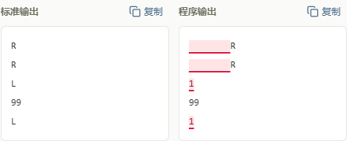

# 编程反馈简化与验证

2026-10-07 在现有纸色、钢蓝和黏土橙风格下，简化三端公开样例对比和编程提交结果，让学生先看懂哪里有问题、题目是否通过。

状态：2026-10-07 已部署到 `https://botcode.work`，应用源码为 `79ba0214a58acfca55c0c1a7b248354b0f887e80`。Linux 发布包、备份、线上验证与 Git 保存范围见 [发布记录](ops-review-2026-10-07-programming-feedback.md)。

## 界面约定

公开样例不匹配时，标准输出保持原样，只在程序输出中标红错误字符与多余空格；漏输出的位置提示“缺少内容”，错误换行有红色标记。两侧复制按钮均复制原始文本，不包含标注。页面不显示绿色应有内容、复杂符号图例、空白符开关或首处差异坐标。

对比与 Judge 共用 `normalizeCppOutput` 的规则：统一换行格式，忽略每行末尾空格/制表符及末尾空白；显示和复制仍保留原文。按 Unicode 码点比较并映射回原始输出位置，避免拆开 UTF-16 代理对。长文本比较限制为 1,000,000 个矩阵单元，超限按区段标红；API 原有 5,000 字符预览截断不变，截断时只标记已显示内容并提示。

只有 `mismatched` 且包含公开标准输出的试运行才使用对比；匹配、自定义输入、编译失败和运行异常保留原反馈。学生正式提交的隐藏测试不会进入该对比。

编程正式提交采用紧凑卡片，详情入口保留原角色及考试路径：

| 服务端状态 | 卡片显示 |
| --- | --- |
| `Accepted` | 绿色“通过了”，测试点与耗时合并一行 |
| `Wrong Answer` | 红色“未通过”，注明“答案不正确” |
| `Compile Error` | 红色“未通过”，注明“编译错误”；提示检查代码，不展示未执行的测试统计 |
| `Runtime Error` | 红色“未通过”，注明“程序运行出错” |
| `Time Limit Exceeded` | 红色“未通过”，注明“运行超时” |
| 未知状态 | 中性“结果待确认”，提示查看提交记录 |

卡片只接收状态、统计和详情地址，不展示错误原文、测试输入或输出。详细编译信息及有权读取的测试数据保留在原提交详情页；学生隐藏测试继续由服务端脱敏。通过动效、奖励、任务进度、考试保护、权限和计分保持原行为；选择判断题继续使用逐题反馈。

## 源码与检查入口

| 用途 | 入口 |
| --- | --- |
| 试运行与对比接入 | [ProblemRunPanel](../src/components/ProblemRunPanel.tsx)、[OutputComparison](../src/components/OutputComparison.tsx) |
| 归一化、截断与原始位置映射 | [cppRun](../src/lib/cppRun.ts)、[outputDiff](../src/lib/outputDiff.ts) |
| 提交卡片与原流程接入 | [ProgrammingSubmissionResult](../src/components/ProgrammingSubmissionResult.tsx)、[ProblemSubmitForm](../src/components/ProblemSubmitForm.tsx) |
| 完整详情与学生脱敏 | [SubmissionDetailView](../src/components/SubmissionDetailView.tsx)、[submissionVisibility](../src/lib/submissionVisibility.ts) |
| 样例浏览器验证 | [output-diff.spec.ts](../e2e/output-diff.spec.ts) |
| 提交卡片浏览器验证 | [submission-result.spec.ts](../e2e/submission-result.spec.ts) |

## 2026-10-07 本地验证

| 检查 | 证据与范围 |
| --- | --- |
| 样例相关单元测试 | 4 个文件、21 项通过；覆盖原文、空白规则、遗漏、Unicode、长文本、截断和安全文本渲染 |
| 提交相关回归单元测试 | 3 个文件、6 项通过；通过图片预加载、直接取图、提交详情脱敏和客观题逐题反馈 |
| 样例浏览器测试 | 5 项通过；三端原文、差异标红、复制、空输出、长文本、截断及既有运行状态 |
| 提交卡片浏览器测试 | 3 项通过；三端五种评测结果、精简统计、键盘详情入口及完整编译信息 |
| 屏幕宽度 | 上述浏览器测试检查 320、768、1280、1440px；主体无横向溢出 |
| TypeScript / lint | 最终界面版本均通过 |
| 本地应用与评测 | 健康接口 200、数据库正常；Docker Linux 环境运行，实际编译、两组样例匹配及不匹配识别已验证 |
| 最终本地构建 | 生产模式构建通过（83 页）；使用独立 `.next-e2e` 输出，结束后清理并恢复配置，本地开发服务继续运行。随后完成 Linux standalone 构建及线上验收，见发布记录 |

浏览器验证使用一次性 `prisma/e2e.db` 和 3100 端口，以受控试运行/提交响应检查显示，再通过真实详情页验证入口；不据此宣称重新完成了正式 Docker 提交评测。E2E 运行器恢复生成的 TypeScript 配置，并清理一次性数据库和测试产物。

复查命令：

```bash
npm run test -- src/lib/outputDiff.test.ts src/components/OutputComparison.test.tsx src/components/ProblemRunPanel.test.tsx src/lib/cppRun.test.ts
npm run test -- src/components/ProblemSubmitForm.ac-image.test.ts src/components/SubmissionDetailView.test.tsx src/components/ObjectiveSubmissionBreakdown.test.tsx
npm run test:e2e -- output-diff.spec.ts submission-result.spec.ts
npx tsc --noEmit
npm run lint
```

## 截图

以下为隔离浏览器环境的受控数据，不是线上学生提交记录。

公开样例：左侧原样显示标准输出，右侧标红多余空格及错误字符。



通过结果：


未通过结果：


用户操作见 [学生手册](student-guide.md)、[老师手册](teacher-guide.md) 和 [管理员手册](admin-guide.md)；当前发布证据见 [2026-10-07 发布记录](ops-review-2026-10-07-programming-feedback.md)，后续更新按 [部署手册](deploy.md) 执行。
